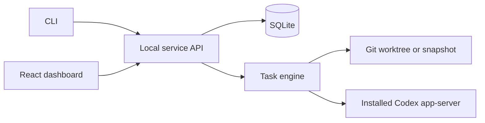
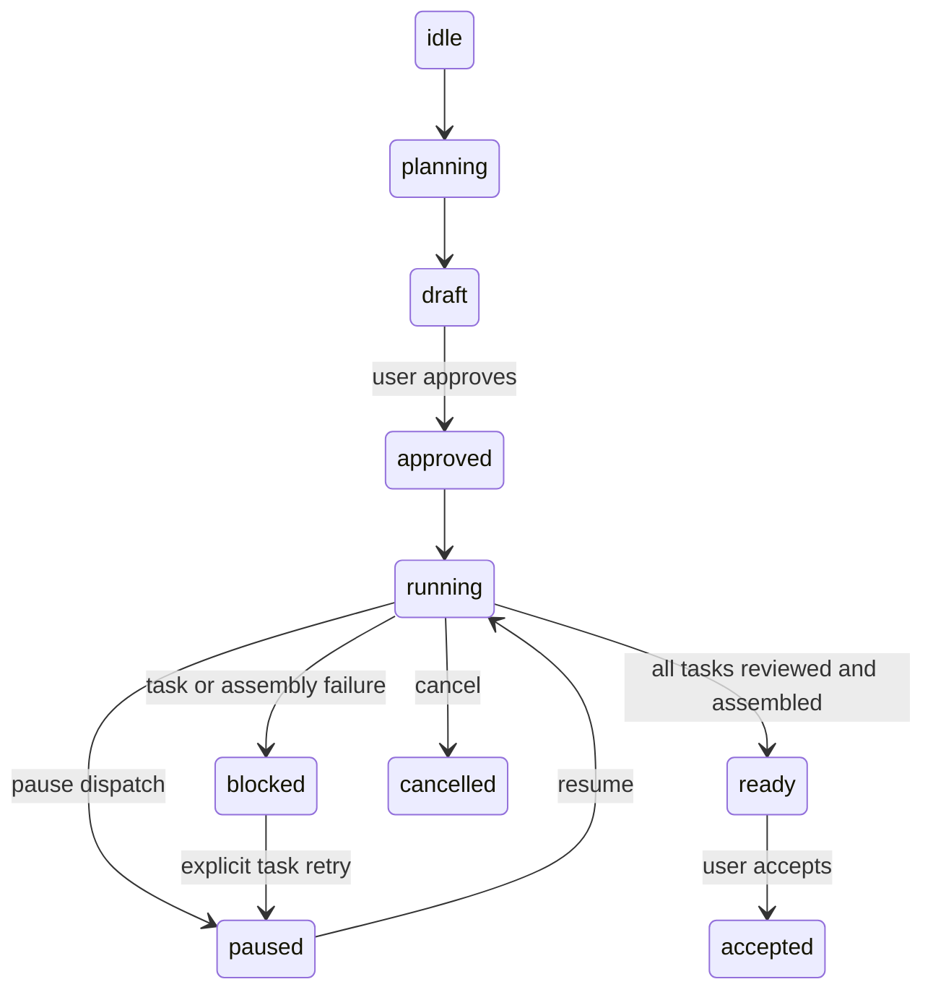

# Architecture

Remora has one local TypeScript service, SQLite state under the Remora home, a React dashboard, and a CLI that calls the same local API. The default home is `~/.remora`; `--home` selects another location. The default service port is `7437`.

The provider boundary is an adapter for the installed, unmodified Codex app-server. Provider profiles and credentials stay managed by Codex. A project plan assigns work to selected account aliases. The user approves the lead's plan; the same lead account later reviews worker submissions. Execution allows one active turn per account, four active turns globally, and up to 16 project turns (the effective project limit is the lower cap); tasks allow two revision rounds. Provider turns have a 30-minute limit.

Task isolation uses a Git worktree when the project is a Git repository and a filesystem snapshot otherwise. Results are staged for review; conflict checks run before explicit acceptance. Native subagents are disabled; Remora child tasks are future work. Claude, Grok, and remote nodes are future adapters.

## State and recovery

Task states distinguish execution from review: `pending → running → review → reviewing → accepted`. Rejected work returns to pending until its revision limit; errors block the project. Startup reconciliation suspends scheduling and reads saved provider sessions. Uncertain attempts remain interrupted until the user explicitly retries them.

SQLite stores account metadata, project/task state, and redacted events. Artifact bodies remain on disk. It stores no provider credentials. A service lock prevents two Remora processes from controlling the same state directory. Schema version 1 is recorded in `meta`; future schema changes require a migration and backup strategy.

The HTTP API is local and pre-alpha. `/api/state` supplies the dashboard snapshot, `/api/events?after=ID` supplies ordered event pages, and account/project action routes back the CLI commands. State-changing routes use POST. Authentication uses a bearer token for the CLI and an HTTP-only SameSite cookie for the browser; both originate from the locally generated runtime token. Host and Origin checks reject remote browser origins.
